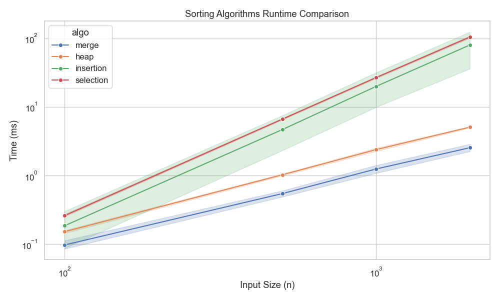

Algorithms Project
===================

Compare four classic sorting algorithms (merge, heap, insertion, selection) on different data distributions and visualize their performance. Metrics captured include comparisons, swaps, and runtime.

What’s inside
-------------
- `algorithms.py`: Sorting implementations + metric collection.
- `experiments.py`: Generates data (random, sorted, reversed, nearly sorted), runs trials across input sizes, and saves a CSV.
- `visualize.py`: Reads the CSV and draws runtime charts.
- `main.py`: One-shot runner for experiments and plotting.
- `results/`: Generated CSV and plot outputs (log-scale runtime chart).

Setup
-----
1) Use Python 3.10+.
2) Install dependencies:
   ```
   pip install -r requirements.txt
   ```

Run everything
--------------
Run experiments and build plots:
```
python main.py
```
- Outputs `results/sorting_results.csv`.
- Saves `results/runtime_comparison.png`.
  - Preview:
    

Only plotting (if CSV already exists)
-------------------------------------
```
python -c "from visualize import visualize_results; visualize_results('results/sorting_results.csv')"
```

Notes
-----
- You can explore the CSV and plots in `results/`, or open `results/df.ipynb` in Jupyter for custom analysis.